## Task - Day 11

### Project Overview - Create a private git repo that has a maven project. In Jenkins create 2 freestyle project, one to compile that maven project and other to test that maven project. Create a pipeline view of the project.

#### Step 1. Private Git Repo

+ Creating private git repo and push the code

---

#### Step 2. Compile maven project

+ Creating new freestyle project "dev_compile"

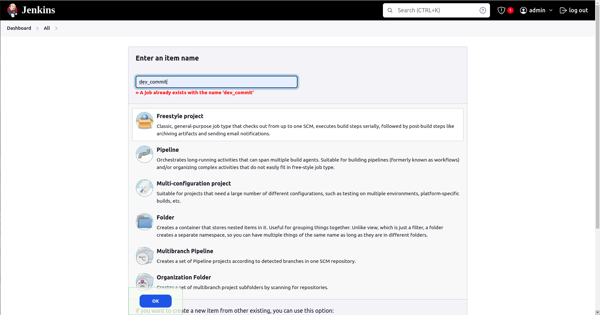
---

+ Setting up and Configuring git credentails in jenkins

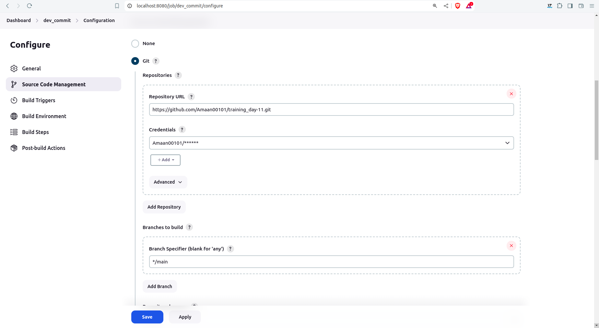
---

+ Setup Maven Installation in Jenkins

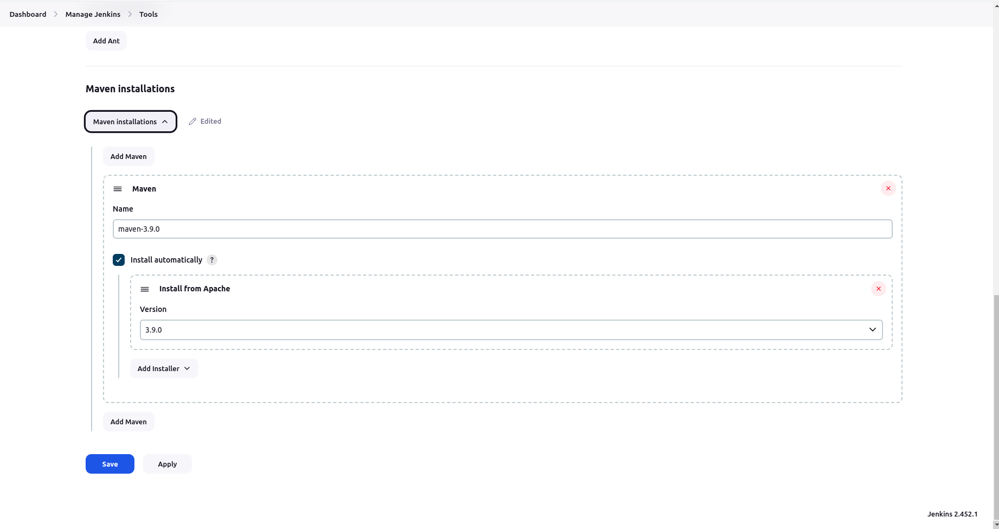
---

+ Setup Maven Build Steps COMPILE

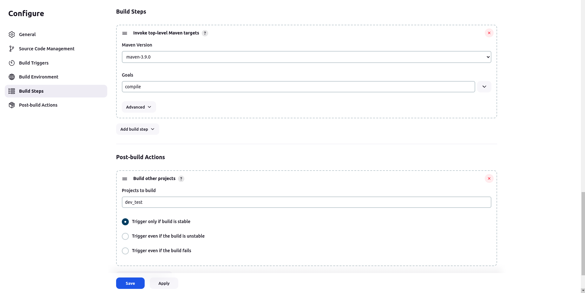
---

+ Build "dev_compile" Project

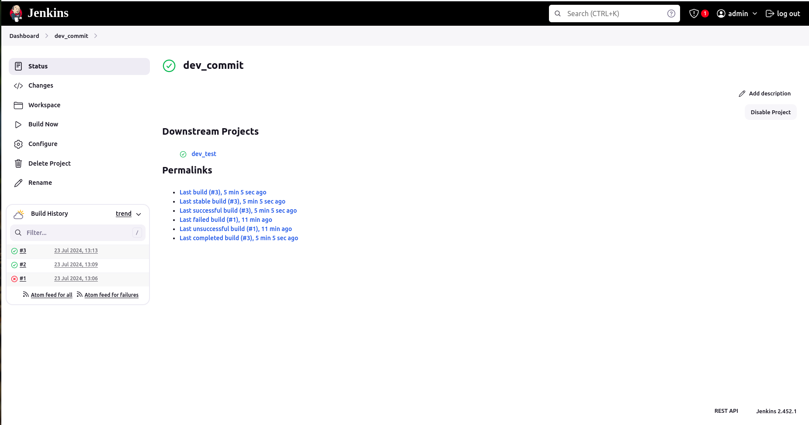

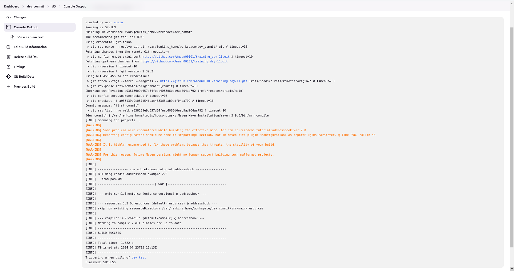
---

#### Step 3. Test maven project

+ Creating another Freestyle Project "dev_test"

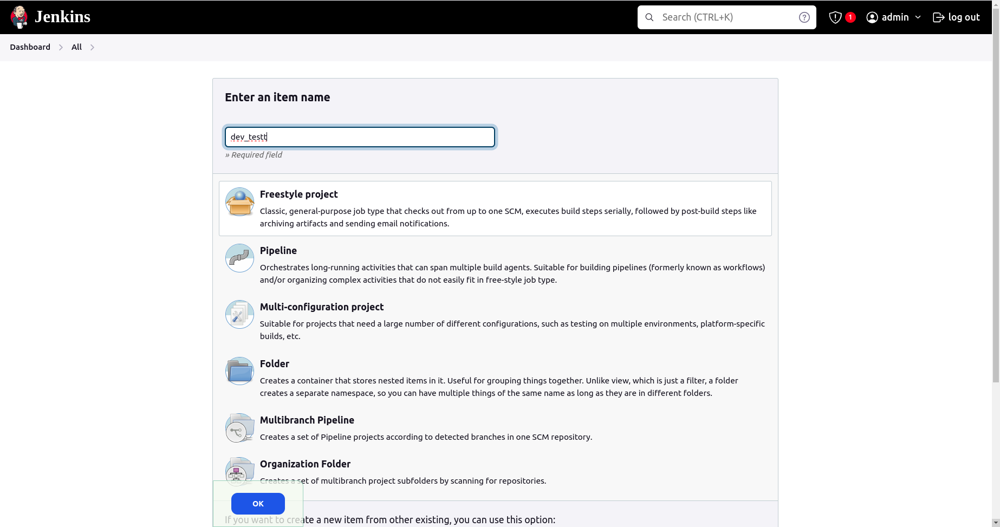
---

+ Setup Maven Build Steps TEST

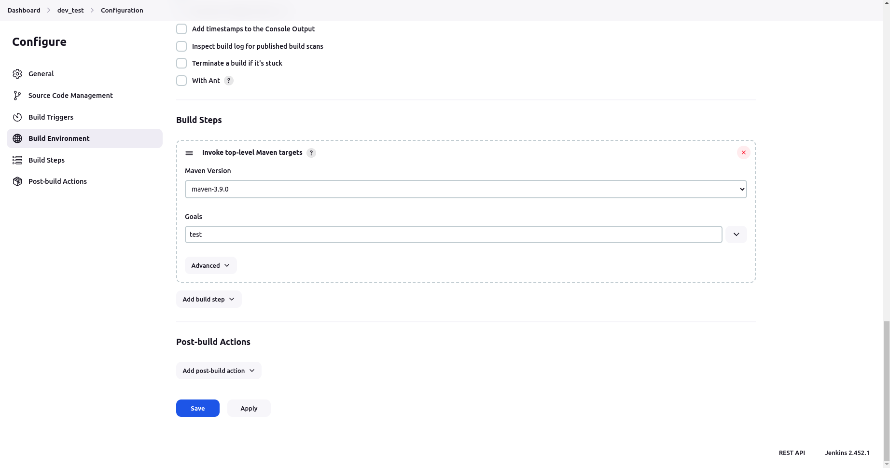
---

+ Build "dev_test" Project

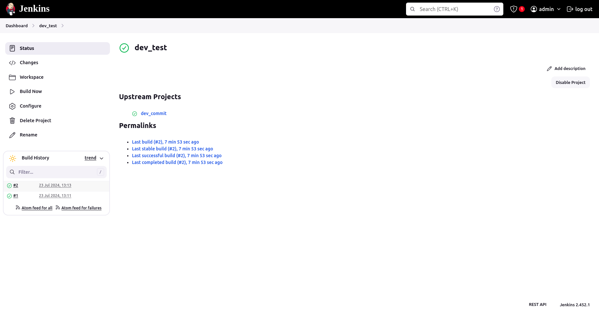

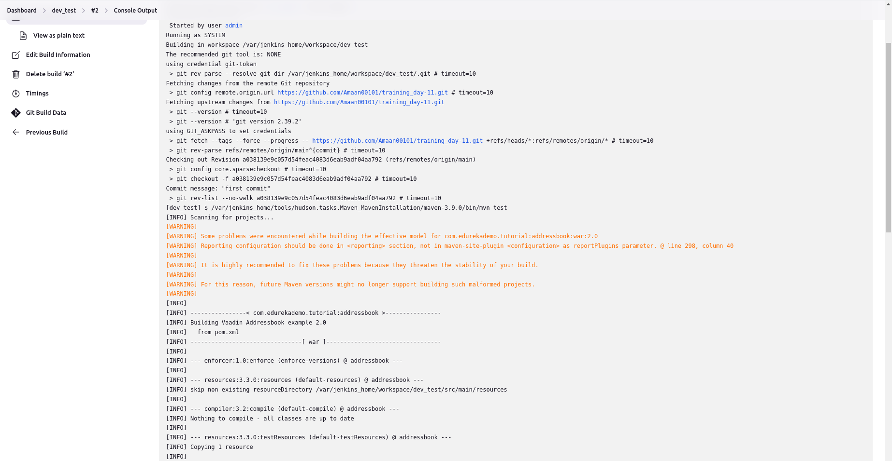

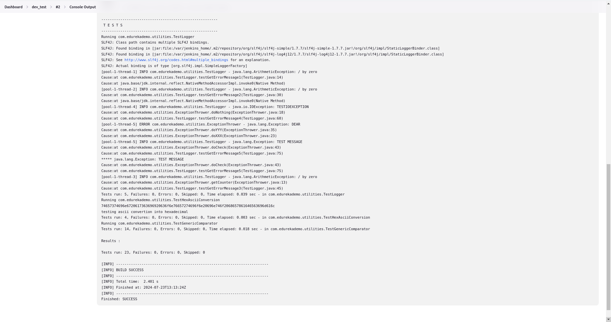
---

#### Step 4. Pipeline view

+ Create new "build pipeline" in jenkins

---

+ Fill the details

---

+ Final Output of Pipeline view

---