## Day-9 Project

### Stage 1: Setting Up the Kubernetes Cluster and Static Web App

#### 1. Set Up Minikube:
+ Ensure Minikube is installed and running on the local Ubuntu machine.

+ Verify the Kubernetes cluster is functioning correctly.
```
minikube start
```

---
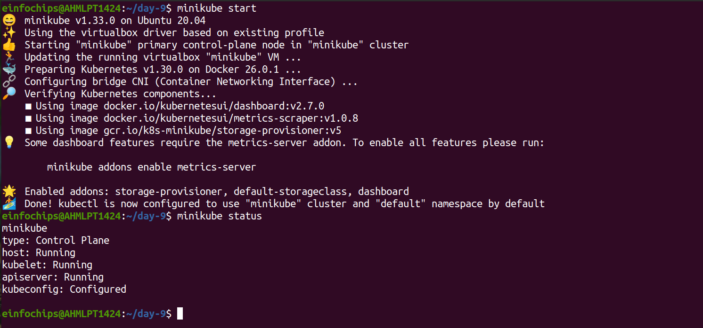
---

#### 2. Deploy Static Web App:
+ Create a Dockerfile for a simple static web application (e.g., an HTML page served by Nginx).

```
<!DOCTYPE html>
<html lang="en">
<head>
    <title>Static Website</title>
</head>
<body>
    <h2>Welcome to my static Website</h2>
</body>
</html>
```

+ Build a Docker image for the static web application.

```
FROM nginx:alpine

COPY index.html /usr/share/nginx/html/

EXPOSE 80

CMD ["nginx", "-g", "daemon off;"]
```

+ Push the Docker image to Docker Hub or a local registry.
---
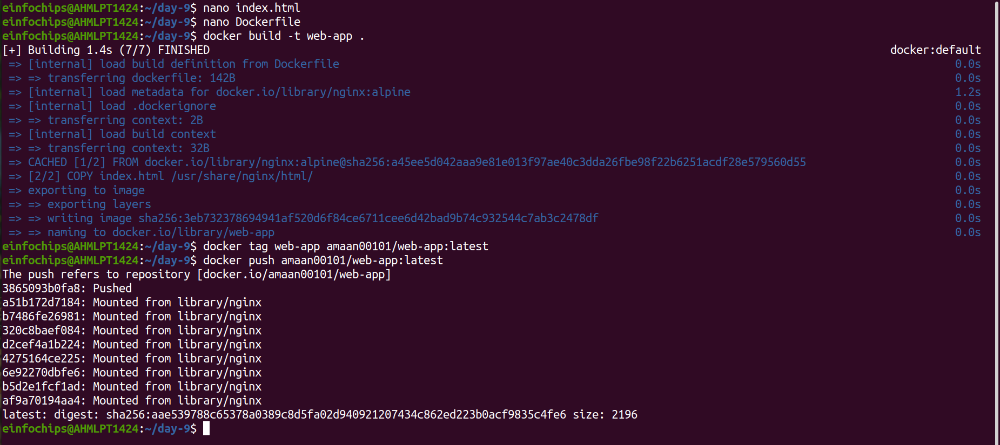
---

#### 3. Kubernetes Deployment:
+ Write a frontend deployment & service manifest to deploy the static web application.
```
apiVersion: apps/v1
kind: Deployment
metadata:
  name: frontend
spec:
  replicas: 1
  selector:
    matchLabels:
      app: frontend
  template:
    metadata:
      labels:
        app: frontend
    spec:
      containers:
      - name: frontend
        image: amaan00101/web-app:latest
        ports:
        - containerPort: 80
        resources:
          requests:
            cpu: "50m"
          limits:
            cpu: "20"
```
+ Write a backend deployment & service manifest to expose the static web application within the cluster.
```
apiVersion: v1
kind: Service
metadata:
  name: frontend-service
spec:
  selector:
    app: frontend
  ports:
    - protocol: TCP
      port: 80
      targetPort: 80
```
+ Apply the deployment and service manifests to the Kubernetes cluster.
```
kubectl apply -f deployment.yaml
kubectl apply -f service.yaml
```
---
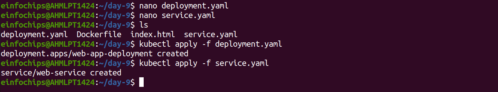
---

### Stage 2: Configuring Ingress Networking

#### 4. Install and Configure Ingress Controller:
+ Install an ingress controller (e.g., Nginx Ingress Controller) in the Minikube cluster.
```
minikube start --addons=ingress
```
+ Verify the ingress controller is running and accessible
```
kubectl get pods -n kube-system
```

---
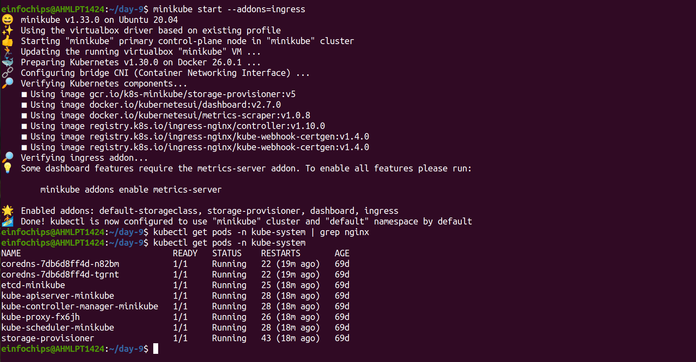
---

#### 5. Create Ingress Resource:
+ Write an ingress resource manifest to route external traffic to the static web application.

+ Configure advanced ingress rules for path-based routing and host-based routing (use at least two different hostnames and paths).
```
sudo nano /etc/hosts
minikube-ip mywebapp.local
```
+ Implement TLS termination for secure connections.

---
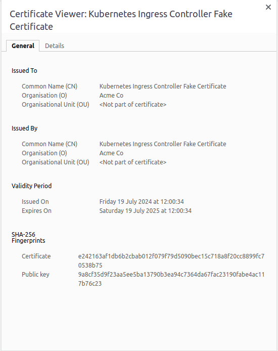
---

+ Configure URL rewriting in the ingress resource to modify incoming URLs before they reach the backend services.

+ Enable sticky sessions to ensure that requests from the same client are directed to the same backend pod.

---
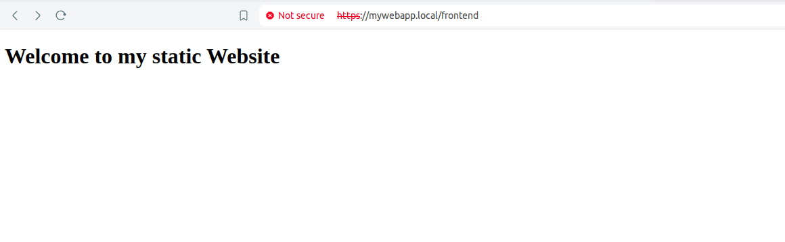

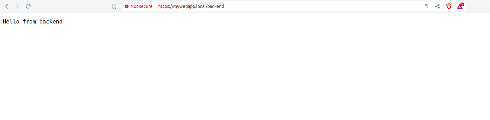
---

### Stage 3: Implementing Horizontal Pod Autoscaling

#### 6. Configure Horizontal Pod Autoscaler:
+ Write a horizontal pod autoscaler (HPA) manifest to automatically scale the static web application pods based on CPU utilization.

+ Set thresholds for minimum and maximum pod replicas.
```
apiVersion: autoscaling/v2
kind: HorizontalPodAutoscaler
metadata:
  name: web-app-hpa
spec:
  scaleTargetRef:
    apiVersion: apps/v1
    kind: Deployment
    name: frontend
  minReplicas: 1
  maxReplicas: 5
  metrics:
  - type: Resource
    resource:
      name: cpu
      target:
        type: Utilization
        averageUtilization: 5
```
---
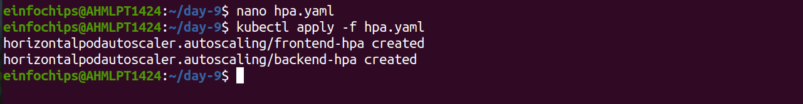
---

#### 7. Stress Testing:
+ Perform stress testing to simulate traffic and validate the HPA configuration.

+ Monitor the scaling behavior and ensure the application scales up and down based on the load.
```
kubectl get hpa
```
---
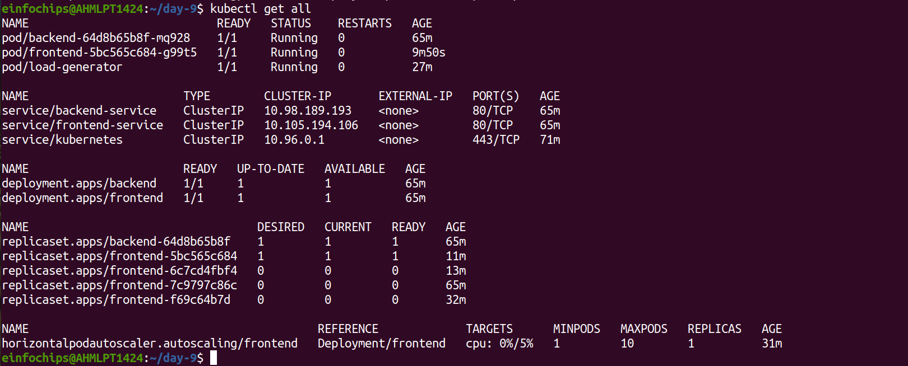

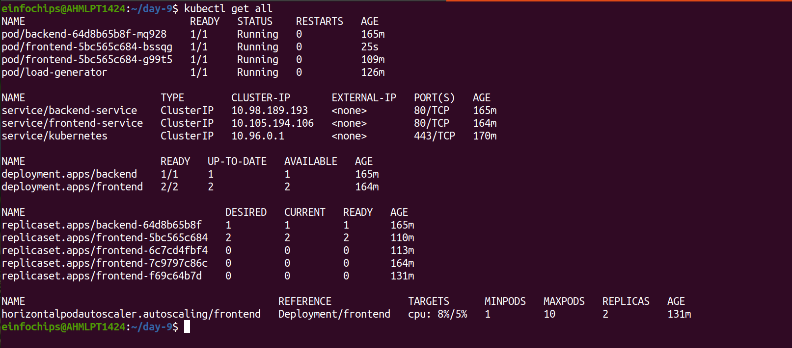
---

### Stage 4: Final Validation and Cleanup
#### 8. Final Validation:
+ Validate the ingress networking, URL rewriting, and sticky sessions configurations by accessing the web application through different hostnames and paths.
```
https://mywebapp.local/
```
+ Verify the application's availability and performance during different load conditions.

---

---

#### 9.Cleanup:
+ Provide commands or scripts to clean up the Kubernetes resources created during the project (deployments, services, ingress, HPA).

```
kubectl delete deployment <deploymnet-name>
kubectl delete service <service-name>
kubectl delete hpa <hpa-name>
```

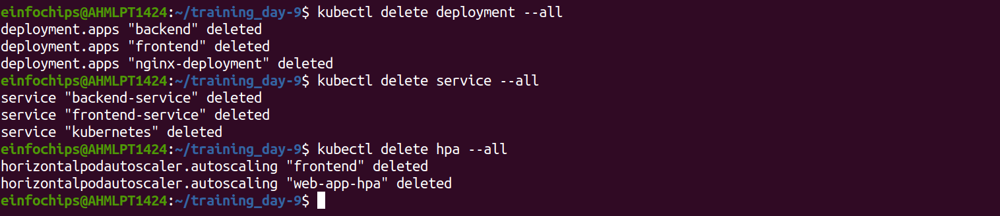

